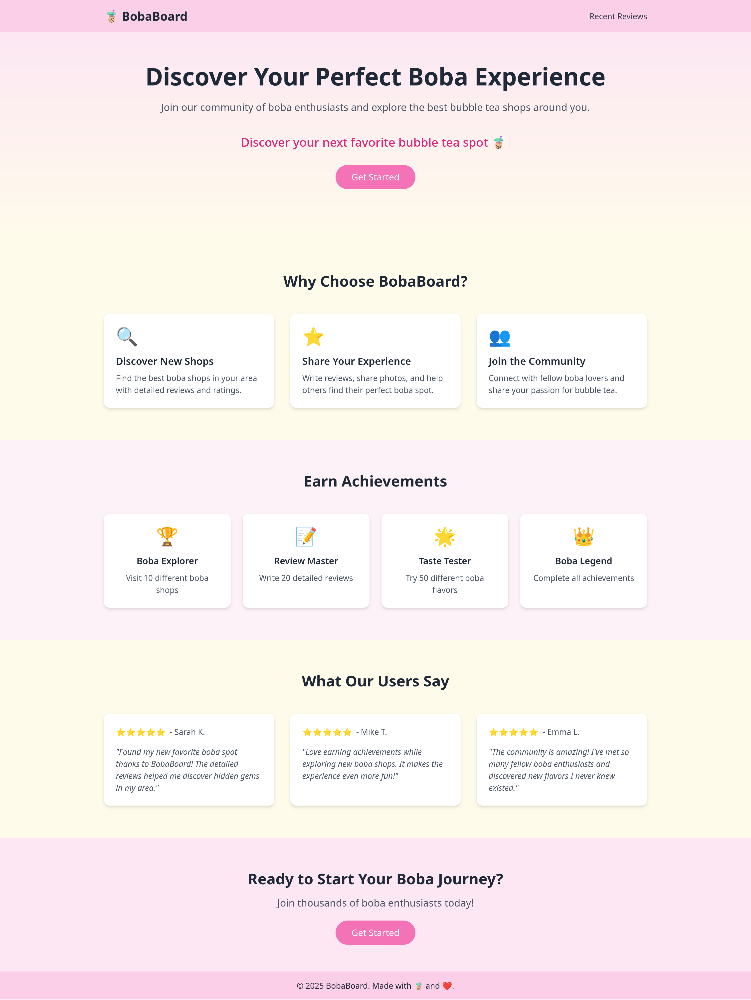
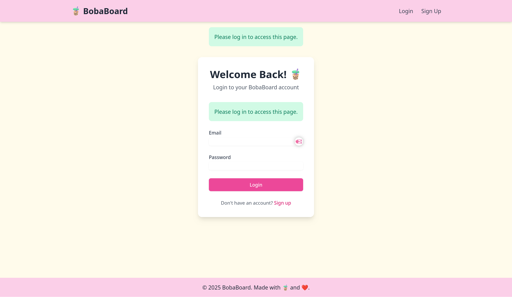
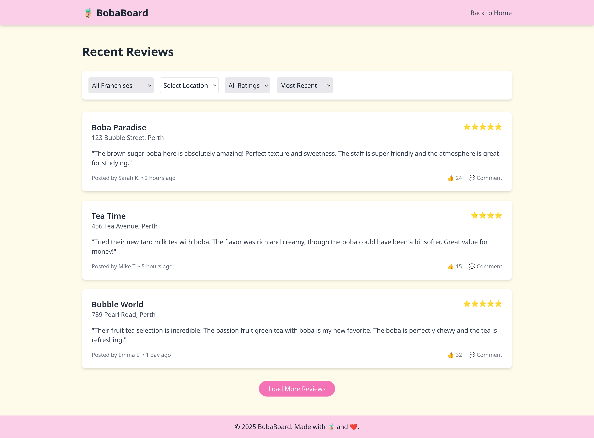

# CITS3403 Group Project - BobaBoard

This is the readme file for the BobaBoard website.

**Group members:**

> Addresses requirement [2](#req_2).

| Name             | UWA Student Number | Github username                                          |
| ---------------- | ------------------ | -------------------------------------------------------- |
| Henuka Daluwatta | 23335255           | [@Teloshav](https://github.com/Teloshav)                 |
| Marco Gunawan    | 23780778           | [@marcogunawan9763](https://github.com/marcogunawan9763) |
| Austin Ngo       | 23801606           | [@mrtwiggy](https://github.com/mrtwiggy)                 |
| Kyaw Paing Hein  | 23318983           | [@AndrewHein999](https://github.com/AndrewHein999)       |

---

## What is BobaBoard?

> Addresses requirement [1](#req_1).

BobaBoard is an online hub to review bubble tea from various shops, to keep track of your personal preferences and to see what like minded bubble tea fans all over have to say about the best drink around!


**BobaBoard Home Page:**



**BobaBoard Sign In Page:**



**BobaBoard Recent Reviews:**



---

## How do you use BobaBoard?

> Addresses requirement [1](#req_1).

You make an account and start reviewing drinks you've tried at various stores! This allows us to enhance our website to be the most up to date source about what's hot and what's not!


Simply pick what flavours you picked, what toppings you used and tell us what you thought about it!

---

## Deployment instructions

> Addresses requirement [3](#req_3).

Are you interested in using BobaBoard for your business? Below are a detailed list of instructions on how to deploy your own instance of BobaBoard.

**Setting up the Python environment:**

1. Create the environment:
   
   ```shell
   python3 -m venv venv
   ```

2. Enter the environment:
   
   ```shell
   source venv/bin/activate
   ```

3. Install the required packages:
   
   ```python
   pip install -r requirements.txt
   ```

4. Set the config options by editing the `config.yml` file with your preferred text editor.
   
   Example `config.yml` file:
   
   ```yaml
   server_port: 5001
   ```

5. Launch the Flask application:
   
   ```shell
   python app.py
   ```

6. Go to `http://localhost:<server_port>` (in this case it would be 5001 according to the `config.yml` file from step 4).

---

## Contributing

> Addresses requirement [4](#req_4).

**How to run tests for BobaBoard:**

---

## Requirements

The creation of the web application should be done in a private GitHub repository that includes a README containing:

1. A description of the purpose of the application, explaining its design and use. <a name="req_1"></a>
2. A table with with each row containing the i) UWA ID ii) name and iii) Github user name of the group members. <a name="req_2"></a>
3. Instructions for how to launch the application. <a name="req_3"></a>
4. Instructions for how to run the tests for the application. <a name="req_4"></a>
